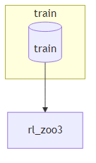
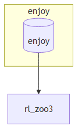

# Project Documentation: RL Baselines3 Zoo

## 1. Introduction

**RL Baselines3 Zoo** is a comprehensive, open-source framework designed to facilitate the training, evaluation, and utilization of Reinforcement Learning (RL) agents. Built on top of the robust [Stable Baselines3](https://github.com/DLR-RM/stable-baselines3) library, this project provides a collection of pre-trained RL models, scripts for easy training and testing, and a standardized set of tuned hyperparameters for various environments.

The primary goals of this framework are to:
- **Simplify the process** of training and enjoying RL agents.
- **Benchmark** the performance of different RL algorithms across a wide range of environments.
- **Provide tuned hyperparameters** to serve as a strong baseline for new research and applications.
- **Showcase the capabilities** of trained agents through visualization.

This repository is a vital tool for both RL researchers and practitioners, enabling rapid prototyping, benchmarking, and deployment of RL solutions.

## 2. Core Features

- **Pre-Trained Agents**: Access to over 200 pre-trained agents for various environments, including Atari games, classic control problems, and robotics simulations.
- **Simple Training Interface**: A straightforward command-line interface to train state-of-the-art RL algorithms like PPO, A2C, SAC, and DQN.
- **Hyperparameter Optimization**: Tools and configurations for tuning hyperparameters to achieve optimal performance.
- **Agent Evaluation and Visualization**: Scripts to evaluate agent performance and record videos of them in action.
- **Integration with Modern Tools**: Supports integration with services like Weights & Biases for experiment tracking and Hugging Face for model sharing.
- **Extensive Documentation**: A well-maintained online documentation portal.

## 3. Core Reinforcement Learning Concepts

To fully understand the project, it's helpful to be familiar with the core concepts of Reinforcement Learning.

-   **Agent**: The agent is the learner or decision-maker. In the context of this project, the agents are the algorithms from Stable Baselines3 (e.g., PPO, A2C, SAC). The agent interacts with the environment by taking actions.

-   **Environment**: This is the world in which the agent operates and learns. It can be a game (like Ms. Pac-Man), a physics-based simulation (like a robot arm), or any other task-based scenario. The environment provides feedback to the agent in the form of states and rewards.

-   **State**: A state is a snapshot of the environment at a particular moment. It contains all the information the agent needs to make a decision. For example, in a chess game, the state would be the positions of all the pieces on the board.

-   **Action**: An action is a move that the agent can take in the environment. The set of all possible moves is called the action space. For example, in a maze, the actions could be 'move left', 'move right', 'move up', or 'move down'.

-   **Reward**: A reward is the feedback the agent receives from the environment after performing an action in a particular state. The agent's goal is to maximize the total cumulative reward over time. Rewards can be positive (for desirable outcomes) or negative (for undesirable ones).

-   **Policy (π)**: The policy is the "brain" of the agent. It is a mapping from states to actions, defining the agent's behavior. In other words, the policy tells the agent which action to take in each state. In deep reinforcement learning, the policy is typically represented by a neural network. The goal of training is to find the optimal policy that maximizes the cumulative reward.

-   **Value Function (V or Q)**: The value function estimates the expected future reward from being in a certain state (or taking a certain action in a certain state). It helps the agent make decisions by predicting which states are more valuable.
    -   **State-Value Function (V(s))**: The expected return when starting in state *s* and following the policy thereafter.
    -   **Action-Value Function (Q(s, a))**: The expected return when starting in state *s*, taking action *a*, and then following the policy.

-   **Model (Optional)**: Some RL agents learn a *model* of the environment, which is a representation of how the environment works. The model predicts the next state and reward given the current state and action. Algorithms that use a model are called *model-based*, while those that don't (like most in this Zoo) are *model-free*.

The entire process forms a loop: the agent receives a state from the environment, uses its policy to choose an action, performs the action, and receives a new state and a reward from the environment. This loop continues until the agent learns the optimal policy.

## 4. Architecture Overview

The project is structured around a set of core Python scripts that handle different phases of the RL workflow. The high-level architecture is modular, separating training, evaluation, and hyperparameter management into distinct components.

Below are the high-level dependency graphs for the main `train.py` and `enjoy.py` scripts, illustrating their primary module dependencies.

### Training Architecture (`train.py`)

This diagram shows the modules that `train.py` depends on to execute a training job. It highlights dependencies on `argparse` for command-line argument parsing, `os` for file system operations, and the core `stable_baselines3` and `rl_zoo3` libraries for the actual RL implementation.



### Enjoy/Visualization Architecture (`enjoy.py`)

This diagram shows the modules required to run a pre-trained agent. Similar to the training script, it relies on `argparse` and `os`, but its main purpose is to load a trained model and interact with the environment, hence the strong dependency on `gym` and the `rl_zoo3` utilities.



## 4. Key Scripts and Usage

### `train.py`
This is the main script for training a new RL agent.

**Usage:**
```bash
python train.py --algo <algorithm_name> --env <environment_id>
```
**Example:** Train a PPO agent on the CartPole-v1 environment.
```bash
python train.py --algo ppo --env CartPole-v1
```

### `enjoy.py`
This script is used to load and visualize a pre-trained agent.

**Usage:**
```bash
python enjoy.py --algo <algorithm_name> --env <environment_id> --folder <path_to_agents>
```
**Example:** Watch a pre-trained A2C agent play the Breakout Atari game.
```bash
python enjoy.py --algo a2c --env BreakoutNoFrameskip-v4 --folder rl-trained-agents/ -n 5000
```

### `benchmark.py`
This script is used to evaluate the performance of all trained agents.

**Usage:**
```bash
python -m rl_zoo3.benchmark
```

## 5. Installation

To get started, you can perform a minimal installation or a full installation that includes extra environments and testing dependencies.

**Minimal Installation:**
```bash
pip install -e .
```

**Full Installation:**
```bash
# On Linux
apt-get install swig cmake ffmpeg

# Install dependencies
pip install -r requirements.txt
pip install -e .[plots,tests]
```

## 6. Getting Started: An Example Workflow

Here is a simple workflow to get started with the RL Baselines3 Zoo:

1.  **Train a new model**:
    Let's train a Proximal Policy Optimization (PPO) agent on the `CartPole-v1` environment. This is a classic control problem and the training is very fast.
    ```bash
    python train.py --algo ppo --env CartPole-v1
    ```
    The trained model and logs will be saved in the `logs/` directory.

2.  **Watch a pre-trained agent play**:
    Now, let's watch a pre-trained agent play Ms. Pac-Man. Make sure you have cloned the `rl-trained-agents` submodule correctly.
    ```bash
    python enjoy.py --algo ppo --env MsPacmanNoFrameskip-v4
    ```
    A window will pop up rendering the game environment where the AI agent is playing.

## 7. Hyperparameters and Configuration

The hyperparameters for each algorithm and environment combination are stored in `.yml` files within the `hyperparams/` directory. These files are crucial for reproducing results and serve as a starting point for tuning on new environments. When `train.py` is executed, it automatically looks for a matching configuration in this directory.

## 8. Conclusion

The RL Baselines3 Zoo is an essential framework for anyone working with Reinforcement Learning. It lowers the barrier to entry by providing a rich set of pre-trained models and a streamlined workflow for training and evaluation. Its modular architecture and comprehensive feature set make it an invaluable asset for both research and practical applications.
